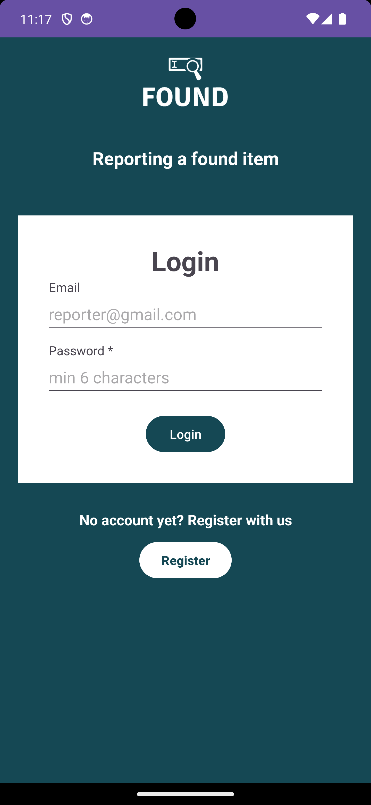
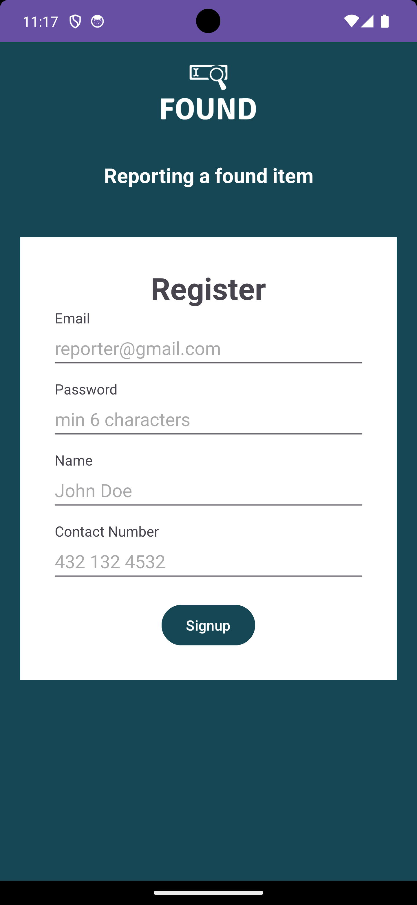
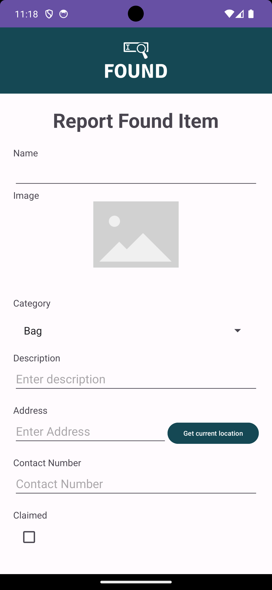
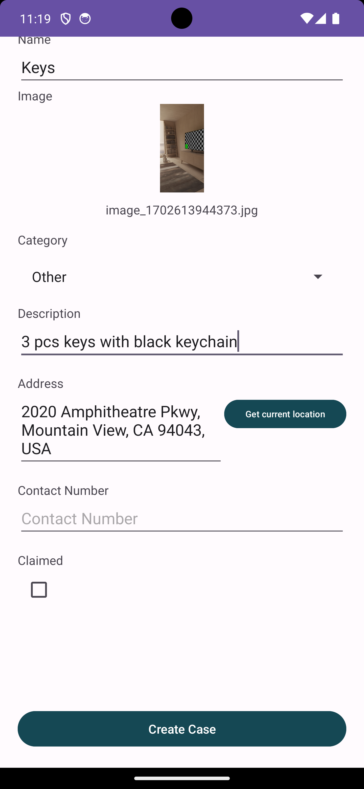
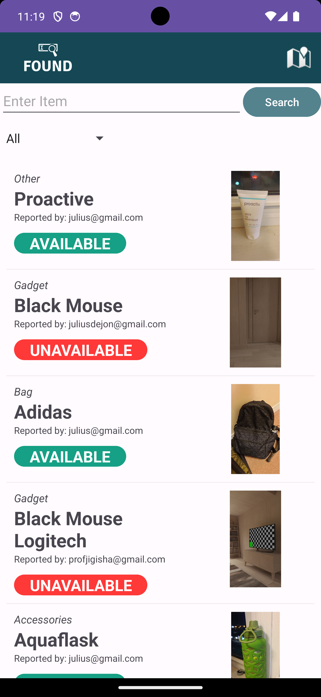
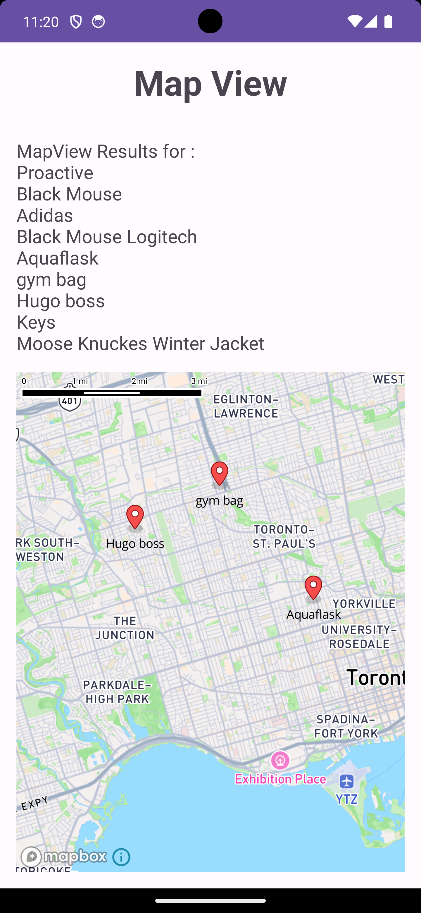
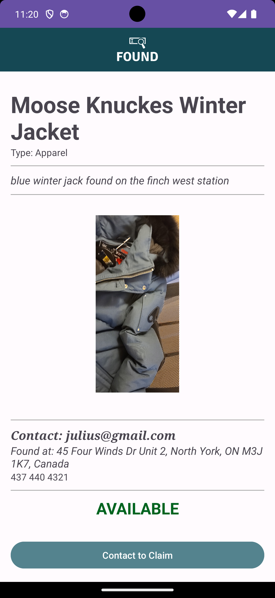

# Lost and Found App made in Android

# Features
- Sign up / Sign In as Reporter
- Browse for found items
- Search by category
- Search by Map View
- Contact the Reporter

# Services and Architecture
- Firebase firestore
- Firebase storage (storing of images)
- Firebase Authentication (email and password)
- Android Jetpack architecture pattern with added controllers
- MapBox

## Screenshots

  

  

# Author
- Julius
- Leo
- Sankar
